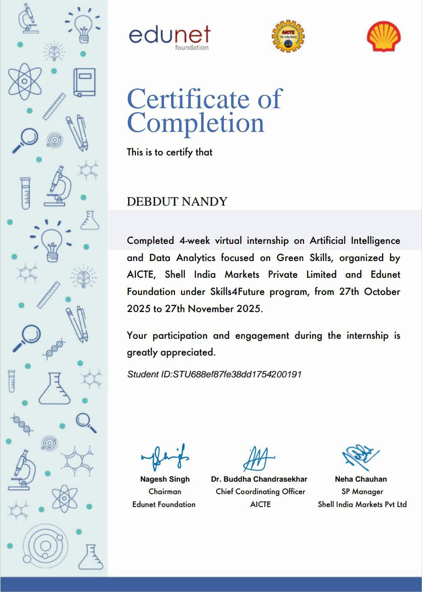
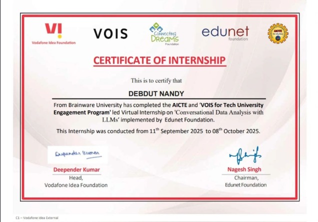
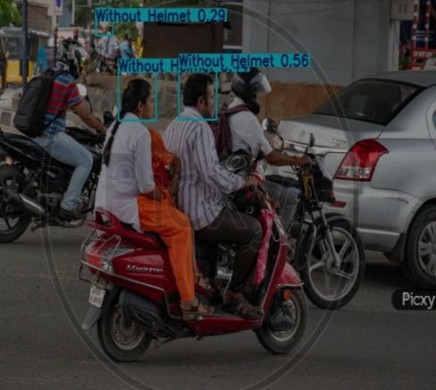
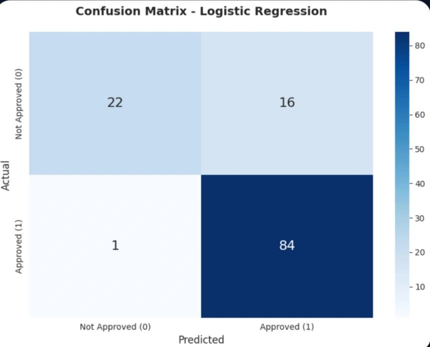
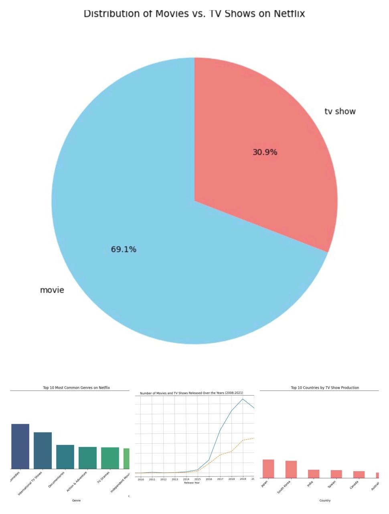

 

  

 

<h1 align="center">Hi 👋, I'm Debdut Nandy</h1>

 

<h2 align="center">👨‍💻 About Me</h2>

Passionate AI & ML developer from India. 
Interested in intelligent systems, automation, and full-stack applications. 
Currently exploring Django, Flask, and Machine Learning deployment.

 

  

 

  

 

🔭 Building AI-powered web applications & Traffic AI systems 🚦

🎓 B.Tech CSE (AI & ML) student 
  passionate about intelligent technologies 🤖

💡 Interested in Machine Learning, automation, and full-stack development 🧠

🌱 Currently learning Django, Flask, and ML deployment 🚀

⚡ Love building projects and exploring new technologies 💻

 
<h3 align="center">Check My Portfolio👉</h3>

  

 

<h3 align="center">Check My Resume👉</h3>

  

 

<h2 align="center">💼 Experience</h2>

 

<!-- AICTE Edunet Internship -->

<h3 align="center">🤖 AICTE Edunet Internship</h3>

 

Worked on an AI-powered Helmet Detection System using YOLOv8n and Computer Vision technologies for real-time safety monitoring.

  
  
  

  

  

  

<!-- VOIS Internship -->

<h3 align="center">📊 AICTE Approved VOIS Internship</h3>

  

Completed a Data Analytics internship under VOIS where I worked on Netflix Dataset Analysis to uncover trends, patterns, and insights using data visualization and analytics tools.

  
  
  
  
  

  

 

  

 

<h2 align="center">🚀 Tech Stack</h2>

<h3 align="center">💻 Languages</h3>

  
   

<h3 align="center">🤖 AI / ML</h2>

  
  
  
  
  
  
  

<h3 align="center">🌐 Web Development</h3>

  

<h3 align="center">🛠️ Tools & Platforms</h3>

  

<h3 align="center">📚 Currently Learning</h3>

  

  

<h2 align="center">🗂️ Featured Projects</h2>

 

<!-- Helmet Detection -->

<h3 align="center">👨‍🏭 Helmet Detection System</h3>

  

AI-powered helmet detection system using YOLOv8n for real-time safety monitoring.

  
  
  
  
  
  
  
  
  

  

  

<!-- House Price Prediction -->

<h3 align="center">🏠 House Price Prediction System</h3>

  

Machine learning model for predicting house prices using regression techniques.

  
  
  
  
  
  
  

  

  

<!-- Loan Approval -->

<h3 align="center">🏦 Bank Loan Approval System</h3>

  

ML-based loan eligibility prediction system using financial and customer data.

  
  
  
  
  
  
  

  

  

<!-- Netflix Analysis -->

<h3 align="center">🎬 Netflix Dataset Analysis</h3>

  

Data analysis project exploring Netflix content trends and insights through visualization.

  
  
  
  
  
  
  

  

  

  

  

<h2 align="center">📈 GitHub Stats</h2>

 

 

 

  

 

<h2 align="center">🏆 GitHub Trophies</h2>

  

 

<h2 align="center"> 🔹 Activity Graph</h2>

  

 

<h2 align="center">🎯 Goals</h2>

🧠 Build ML-integrated apps  
☁️ Learn AWS/Azure  
📚 Contribute to open-source  
🏆 Participate in hackathons  

  

 

<h2 align="center">📩 Connect With Me</h2>

  

  

 

  

  

 

