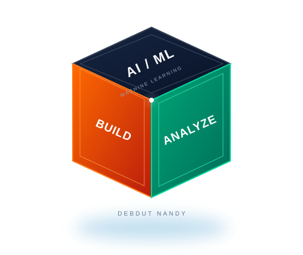

  

 

  

 

<h1 align="center"> Hi, I'm Debdut Nandy </h1>

 

 

  

 

<h2 align="center"> About Me </h2>

Passionate AI & ML developer from India. 
Interested in intelligent systems and ML applications. 

 

  

 

  

 

 Building AI-powered web applications & Traffic AI systems 

 B.Tech CSE (AI & ML) student 
  passionate about intelligent technologies 

 Interested in Machine Learning, automation, and full-stack development 

 Currently learning Flask and ML deployment 

 Love building projects and exploring new technologies 

 
<h3 align="center"> Check My Portfolio </h3>

  

 

<h3 align="center"> Check My Resume </h3>

  

 

  

 

<h2 align="center"> Tech Stack </h2>

<!-- Languages -->
<h3 align="center">Languages</h3>

  
  
  
  

<!-- AI / ML -->
<h3 align="center">AI/ML</h3>

  
  
  
  

<!-- Web Development -->
<h3 align="center">Web Development</h3>

  
  
  
  

<!-- Tools & Platforms -->
<h3 align="center">Tools & Platforms</h3>

  
  
  
  
  
  
  
  
  

<!--Deployments-->
<h3 align="center">Deployment</h3>

  
  
  
  
  

<!-- Currently Learning -->
<h3 align="center">Curently Learning</h3>

  
  

  

<h2 align="center"> GitHub Stats </h2>

  

 

  

<h2 align="center"> Leetcode Profile </h2>

  

  

<h2 align="center"> Goals </h2>

 Build ML-integrated apps and build end-to-end data analytics projects 
 Learn AWS/Azure  
 Participate in hackathons  

  

 

<h2 align="center"> Connect With Me </h2>

  

  

  
  

  
  

 

